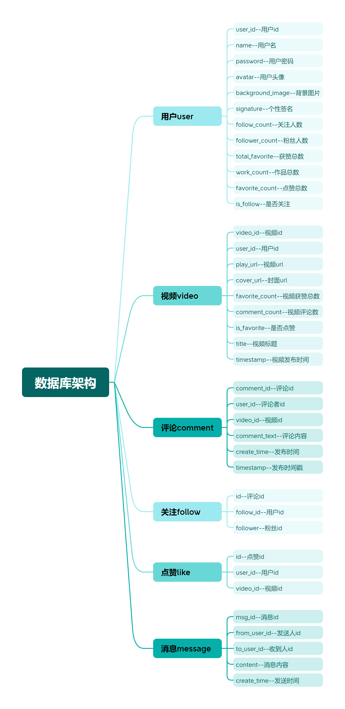
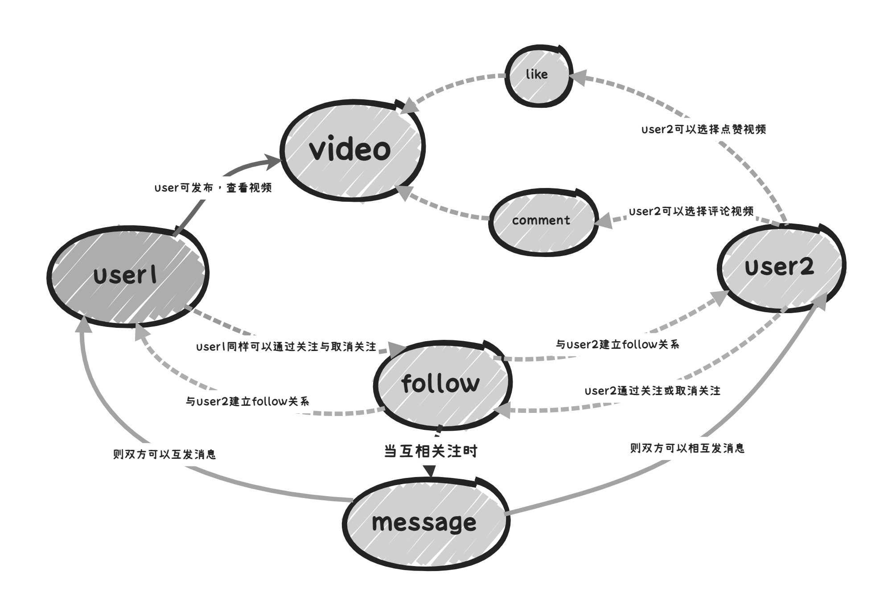
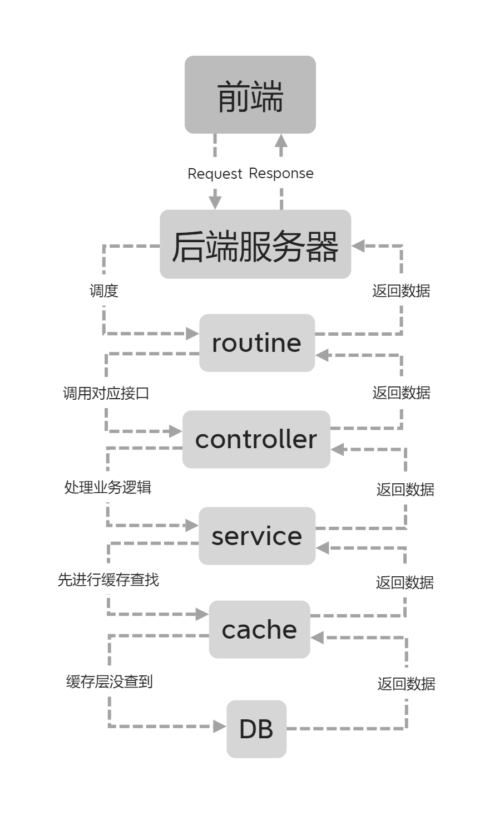
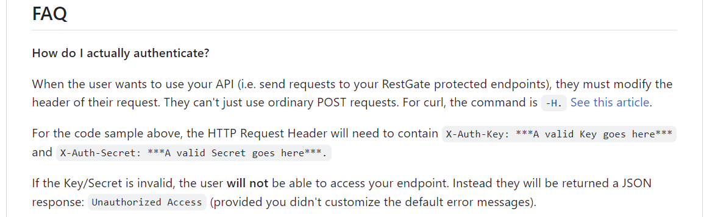

# 			抖音后端Go语言实现

##  一,项目简介：

1. 本项目是参加字节跳动青训营学习Go语言后，自己单人采用gin+gorm框架实现的抖音各个接口
2. 项目目前进度：95%
3. 未完成部分(✔为已完成)：事务的处理✔，数据库结构和sql语句的优化，单元测试的覆盖✔，项目的服务器部署✔（下阶段8.6-8.20任务）
4. 服务器部署地址：http://43.139.38.39:8000/    （详细操作见[极简抖音app使用说明](https://bytedance.feishu.cn/docx/NMneddpKCoXZJLxHePUcTzGgnmf)）

##  二,项目实现：

###  2.1 项目架构

[青训营说明文档](https://bytedance.feishu.cn/docx/BhEgdmoI3ozdBJxly71cd30vnRc)

[apifox文档（青训营提供）](https://apifox.com/apidoc/shared-09d88f32-0b6c-4157-9d07-a36d32d7a75c)

```go
└─Douyin
    ├─cache	        --缓存层
    ├─common		--公共类
    ├─config		--配置类
    ├─controller	--控制器
    ├─dao	        --底层实体类
    ├─middleware	--中间件类
    ├─public		--静态资源仓库
    ├─service		--服务实现类
    └─utils	        --工具类
```

###  2.2 数据库结构与业务逻辑



**为了让表与表之间的联系更加直观我做了另外一个表格，同时这也是简易版抖音的业务逻辑**



​				**其中like表与follow结构相近，储存的都是关系，但是对象是user与video**

​				可以看出数据库共有6张表，其中like与follow为关系表，其余4张为实体表

###  2.3 项目所用到的技术栈

​			**gin+grom+mysql+redis**+docker+nginx代理

###  2.4 项目完成情况

1. 接口文档中所有接口均已实现
2. 支持各数据(如视频，评论)按时间降序排列
3. 密码格式与用户名（即邮箱）校验
4. 邮箱发送验证码与验证码的校验（客户端未提供对接场景，觉得可以优化就写了，已被注释）

##  三,项目亮点

###  3.1 redis做关系表查询的缓存，降低数据库读写压力

​	感觉特别是在抖音这种大型社交平台中，点赞关注评论等动作对于数据库读写性能要求很高，业务繁重的情况下为了防止过多读写导致数据库压力过大，这里采用了redis提供缓存上的支持

***

​	在进行点赞关注等操作的时候，若之前没有进行操作则会在内存中新建数据，利用redis中的set集合，用行为加userid作为主键，将关注的userid或喜欢的videoid分别放入对应的集合。之后在进行用户与用户或者用户与视频的状态判断的时候首先从redis中查找该videoid或者userid是否在“喜欢集合”或者“关注集合中”，若查询不到则回到数据库中查找，缓解数据库的读写压力

​					**数据查询逻辑（也算自己做总结，以后开发的时候可以用，不过有待改进就是了）**



###  3.2 项目安全性能

项目使用**jwt作为鉴权token**，利用**rsa方法**通过token认证中间件进行权限控制，**密码加密防止明文传输**，**用户鉴权认证**

ps: 本来想着github上找一找类似spingsecurity之类的安全框架进行使用，不过似乎只找到一个restgate比较适合，但是可能需要前端在请求头上做更改（  O.o？)于是没有进行整合



###  3.3 代码风格

* restful代码规范，采用阿里巴巴开发规范
* 对函数进行介绍与封装，注释写的比之前详细很多（感觉算进步？

###  3.4 支持事务处理,并且做了数据表结构优化，sql语句优化

使用gorm框架自带的事务处理方法进行数据库操作的事务处理，防止在实际跑的时候因为处理操作量过大，复杂度过高时候数据执行崩溃或者错误，在多个服务在并发访问数据库时对其进行隔离操作防止互相干扰，保证数据库完整性（ACID）

在刚部署上服务器的时候进行软件实测发现内存占用一上去日志就会一直显示slow sql，目前认为主要是服务器配置太低导致（双核2G的轻量应用服务器），但是后来想到可以对数据库结构和sql语句进行优化提升查询性能，于是进行了调整

###  3.5 单元测试覆盖率较高

在utils层，service层，middleware层，common层和cache层均进行了单元测试的覆盖，对每个函数进行了测试，大致做到了高覆盖率（感觉dao层单元测试没必要？因为service里面一并测试了）

##  四，演示视频（手机端apk联调）
详情见飞书云文档：[飞书文档](https://owpzimaggfm.feishu.cn/docx/AWxrdwbH1oWZrvx312IcsWt4nUf)
ps:录屏的时候手机会把输入密码的那一段黑屏，实际操作是没有这个问题的

##  五，学习相关笔记和代码实现笔记
基本上都发在掘金账号上与青训营同步：[相关链接](https://juejin.cn/user/2799802622677688)

##  六，一些项目反思
1. 可以尝试整合消息队列的使用并进行分布式开发
2. 实际应用的话静态资源肯定不能放在服务器本机上供别人访问，还是要使用阿里云之类的对象储存，不然本来就小的带宽压力太大，刷视频巨卡QAQ（部署完自己打开软件玩发现的）
3. 一些地方可以进行优化或者完善：如可以添加登录注册校验验证码的功能，如果后续对算法有学习研究也想加入一些视频推荐之类的功能
4. 除了数据的事务处理之外，感觉还可以加入读写锁保证极高并发情况下的数据安全

##  七，总结
虽然这次的青训营是跨语言开发，而且队友全都是死人（官方组队是真的烂，但是发现自己努努力还是可以完成任务，而且也确实搞懂了很多之前没搞懂的烂尾的没来得及去理解的前几轮考核中没有注意但是很重要的东西，感觉给我最大的收获除了技术方面多学会了一门语言，了解到了更多的技术，学会了这些技术应该如何使用，更重要的是代码习惯变好了，在码代码的时候思维更加严谨了一些，在一些问题比如性能上会更注重了一些相比之前，并且在这个过程中对前面几轮出现的问题（比如上轮组长提到的git使用，服务器防护等）都进行了改善，确确实实应该算成长最大的一轮。
