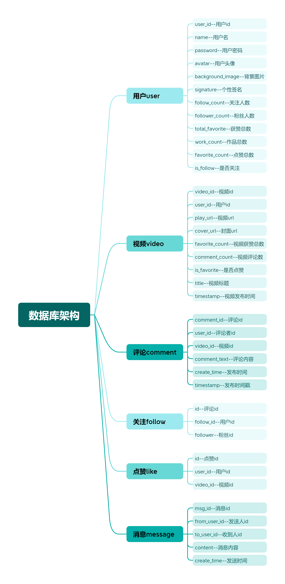
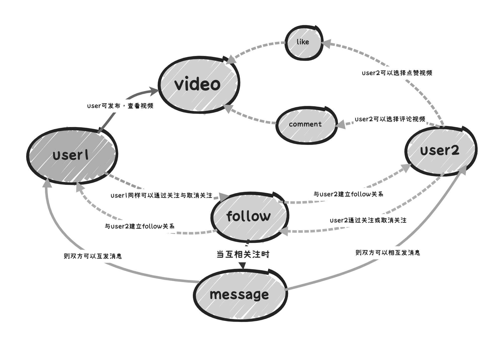
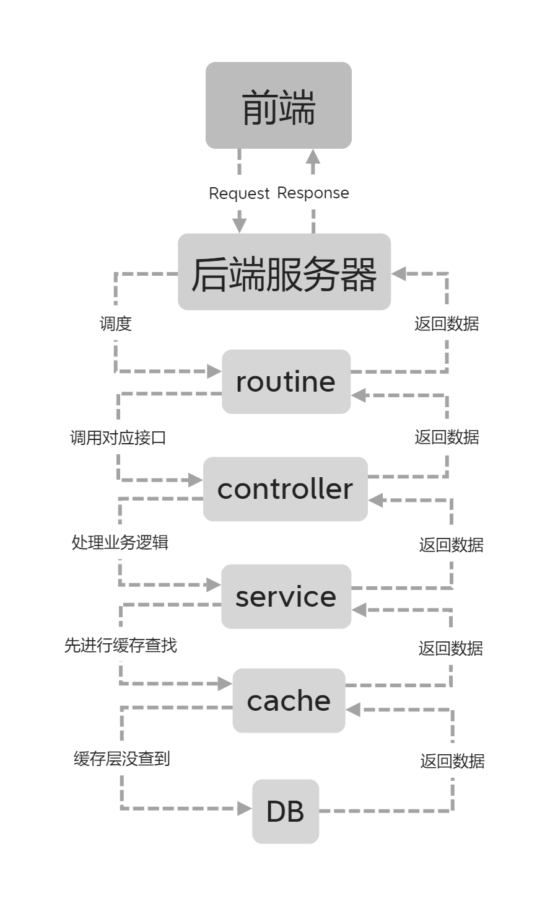
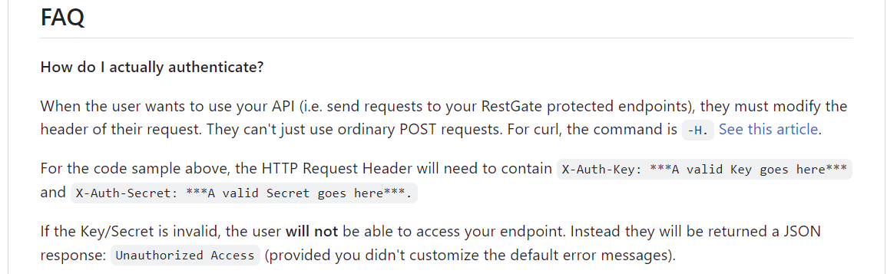

# 			抖音后端Go语言实现

##  一,项目简介：

1. 本项目是参加字节跳动青训营学习Go语言后，自己单人采用gin+gorm框架实现的抖音各个接口
2. 项目目前进度：80%
3. 未完成部分：事务的处理✔，单元测试的覆盖，项目的服务器部署（下阶段8.6-8.20任务）

##  二,项目实现：

###  2.1 项目架构

[青训营说明文档](https://bytedance.feishu.cn/docx/BhEgdmoI3ozdBJxly71cd30vnRc)

[apifox文档（青训营提供）](https://apifox.com/apidoc/shared-09d88f32-0b6c-4157-9d07-a36d32d7a75c)

```go
└─Douyin
    ├─cache	        --缓存层
    ├─common		--公共类
    ├─config		--配置类
    ├─controller	--控制器
    ├─dao	        --底层实体类
    ├─middleware	--中间件类
    ├─public		--静态资源仓库
    ├─service		--服务实现类
    └─utils	        --工具类
```

###  2.2 数据库结构与业务逻辑



**为了让表与表之间的联系更加直观我做了另外一个表格，同时这也是简易版抖音的业务逻辑**



​				**其中like表与follow结构相近，储存的都是关系，但是对象是user与video**

​				可以看出数据库共有6张表，其中like与follow为关系表，其余4张为实体表

###  2.3 项目所用到的技术栈,

​			**gin+grom+mysql+redis**

###  2.4 项目完成情况

1. 接口文档中所有接口均已实现
2. 支持各数据(如视频，评论)按时间降序排列
3. 密码格式与用户名（即邮箱）校验
4. 邮箱发送验证码与验证码的校验（客户端未提供对接场景，觉得可以优化就写了，已被注释）

##  三,项目亮点

###  3.1 redis做关系表查询的缓存，降低数据库读写压力

​	感觉特别是在抖音这种大型社交平台中，点赞关注评论等动作对于数据库读写性能要求很高，业务繁重的情况下为了防止过多读写导致数据库压力过大，这里采用了redis提供缓存上的支持

***

​	在进行点赞关注等操作的时候，若之前没有进行操作则会在内存中新建数据，利用redis中的set集合，用行为加userid作为主键，将关注的userid或喜欢的videoid分别放入对应的集合。之后在进行用户与用户或者用户与视频的状态判断的时候首先从redis中查找该videoid或者userid是否在“喜欢集合”或者“关注集合中”，若查询不到则回到数据库中查找，缓解数据库的读写压力

​					**数据查询逻辑（也算自己做总结，以后开发的时候可以用，不过有待改进就是了）**



###  3.2 项目安全性能

项目使用**jwt作为鉴权token**，利用**rsa方法**通过token认证中间件进行权限控制，**密码加密防止明文传输**，**用户鉴权认证**

ps: 本来想着github上找一找类似spingsecurity之类的安全框架进行使用，不过似乎只找到一个restgate比较适合，但是可能需要前端在请求头上做更改（  O.o？)于是没有进行整合



###  3.3 代码风格

* restful代码规范，采用阿里巴巴开发规范
* 对函数进行介绍与封装，注释写的比之前详细很多（感觉算进步？

###  3.4 支持事务处理

（未完待续）

###  3.5 单元测试覆盖率较高

（未完待续）

##  三,总结
